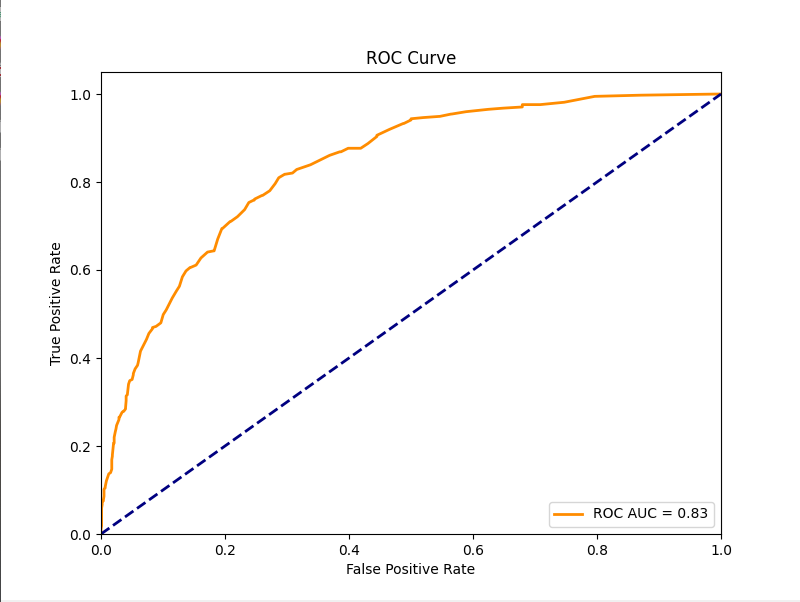
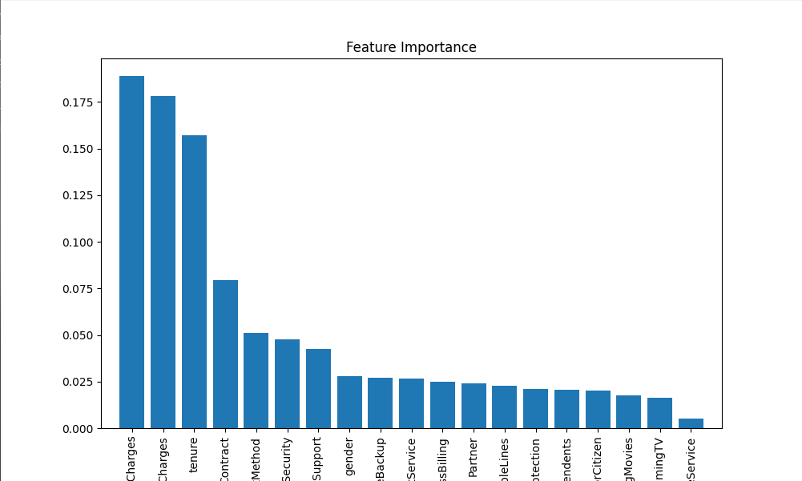
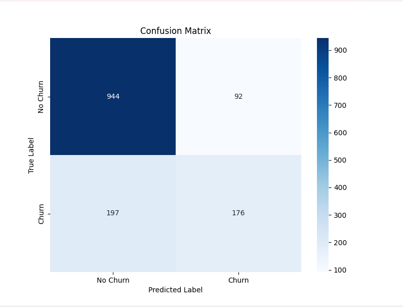
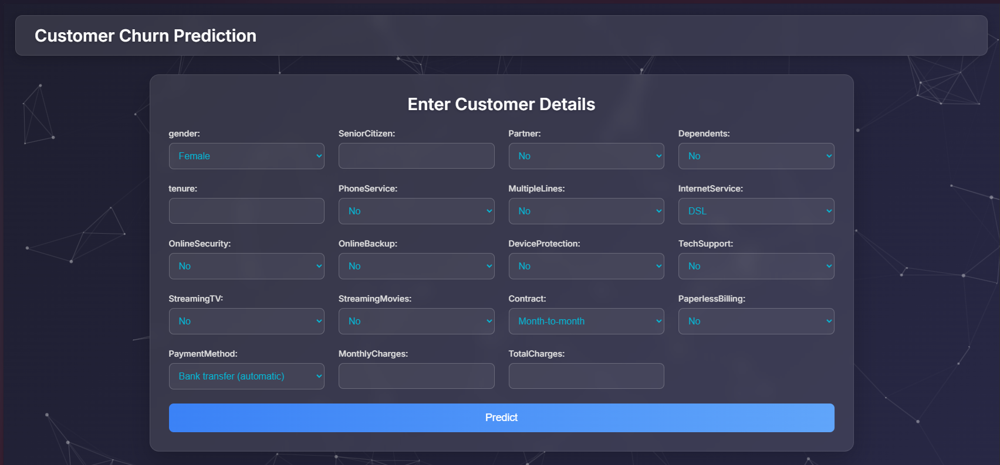
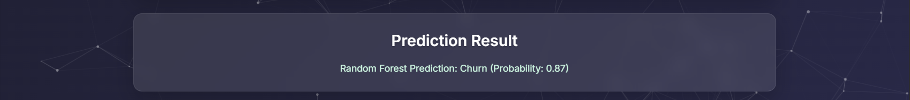

# Customer Churn Prediction

[](https://github.com/your-username/customer-churn-updates)
[](https://www.python.org/)
[](https://unlicense.org/)
[](https://scikit-learn.org/stable/modules/ensemble.html#random-forests)
[](https://scikit-learn.org/stable/modules/tree.html)
[](https://scikit-learn.org/)
[](https://pandas.pydata.org/)
[](https://numpy.org/)
[](https://matplotlib.org/)
[](https://seaborn.pydata.org/)
[](https://imbalanced-learn.org/)
[](https://flask.palletsprojects.com/)
[](https://en.wikipedia.org/wiki/Machine_learning)
[](https://en.wikipedia.org/wiki/Data_science)
[](https://github.com/topics/final-year-project)

## Overview

This project is a Flask-based web application designed to predict customer churn for a telecommunications company. It uses Random Forest and Decision Tree classifiers, with the best model selected based on accuracy. The application preprocesses the `Churn2.csv` dataset, generates visualizations (ROC Curve, Feature Importance, Confusion Matrix), and provides a web interface for users to input customer details and receive churn predictions with probabilities.

## Problem Statement

Customer churn is a critical challenge in the telecommunications industry, leading to revenue loss and increased acquisition costs. This project aims to predict customers at risk of churning based on demographic and service-related attributes, enabling proactive retention strategies through a user-friendly web interface.

## Key Features

- **Data Preprocessing**: Handles missing values, encodes categorical variables, and balances data using SMOTE.
- **Model Training**: Trains Random Forest and Decision Tree classifiers, selecting the best based on test accuracy.
- **Web Interface**: Flask-based form with dynamic dropdowns for categorical features and text inputs for numerical features.
- **Visualizations**: Displays ROC Curve, Feature Importance, and Confusion Matrix plots in the web interface.
- **Prediction Probabilities**: Outputs churn likelihood alongside binary predictions.

## Dataset Description

The `Churn2.csv` dataset, sourced from Kaggle, contains 7,043 records of telecom customer data with 21 columns. Key features include:

- **Demographic Info**: `gender`, `SeniorCitizen`, `Partner`, `Dependents`
- **Service Details**: `tenure`, `PhoneService`, `MultipleLines`, `InternetService`, `OnlineSecurity`, `OnlineBackup`, `DeviceProtection`, `TechSupport`, `StreamingTV`, `StreamingMovies`
- **Billing Info**: `Contract`, `PaperlessBilling`, `PaymentMethod`, `MonthlyCharges`, `TotalCharges`
- **Target Variable**: `Churn` (Yes/No, encoded as 1/0)

The `customerID` column is dropped, and `TotalCharges` is cleaned to handle empty values (replaced with "0.0" and converted to float).

## Exploratory Data Analysis

Exploratory Data Analysis (EDA) was performed to understand feature distributions and relationships with `Churn`. Key analyses include:

- **Churn Distribution**: Analyzed balance of churned vs. non-churned customers.
- **Numerical Features**: Examined distributions of `tenure`, `MonthlyCharges`, and `TotalCharges`.
- **Categorical Features**: Investigated churn rates across `Contract`, `InternetService`, etc.
- **Correlations**: Explored relationships among numerical features.

The following table showcases visualizations generated by the application:

| Visualization Description | Image |
|--------------------------|-------|
| ROC Curve |  |
| Feature Importance |  |
| Confusion Matrix |  |

*Note*: These visualizations are saved in the `static/` directory and displayed in the web interface.

## Model Performance

The application trains Random Forest and Decision Tree classifiers, selecting the best based on test set accuracy. Below is an illustrative performance summary:

| Model          | Accuracy | Precision | Recall | F1-score |
|----------------|----------|-----------|--------|----------|
| Decision Tree  | ~77%     | ~66%      | ~55%   | ~60%     |
| Random Forest  | ~79%     | ~69%      | ~57%   | ~62%     |

*Note*: Metrics are illustrative, as the script computes only accuracy at runtime. Users can extend the code to compute precision, recall, and F1-score.

## Project Workflow

1. **Data Loading**: Load `Churn2.csv`, drop `customerID`, clean `TotalCharges`, and encode `Churn` (Yes=1, No=0).
2. **Preprocessing**: Encode categorical columns using `LabelEncoder` and store encoders for prediction.
3. **Data Splitting**: Split data into features (X) and target (y), with an 80-20 train-test split.
4. **Class Balancing**: Apply SMOTE to balance training data.
5. **Model Training**: Train Random Forest and Decision Tree classifiers, select the best based on accuracy.
6. **Visualization**: Generate and save ROC Curve, Feature Importance, and Confusion Matrix plots in `static/`.
7. **Flask Application**:
   - Render a web form with dynamic inputs (dropdowns for categorical, text for numerical).
   - Process user inputs, encode them, and predict churn using the best model.
   - Display predictions and visualizations in the web interface.

## Key Insights

- **Feature Importance**: Features like `tenure`, `MonthlyCharges`, and `Contract` are key predictors of churn.
- **Model Selection**: Random Forest typically outperforms Decision Tree due to its ensemble approach.
- **Class Imbalance**: SMOTE improves performance by addressing the imbalance in `Churn`.
- **User Experience**: The Flask interface with dropdowns and visualizations enhances accessibility for non-technical users.

## Technologies Used

- **Python**: Core programming language.
- **Flask**: Web framework for rendering the interface.
- **Pandas, NumPy**: Data manipulation and preprocessing.
- **Scikit-learn**: Machine learning models (Random Forest, Decision Tree, LabelEncoder, SMOTE).
- **Imbalanced-learn**: SMOTE for class balancing.
- **Matplotlib, Seaborn**: Visualization generation.
- **HTML/CSS**: Embedded in Flask templates for the web interface.

## Installation and Usage

### Prerequisites

- Python 3.8+
- Required libraries:
  ```plaintext
  flask
  pandas
  numpy
  scikit-learn
  imbalanced-learn
  matplotlib
  seaborn
  ```

### Installation

1. Clone the repository:
   ```bash
   git clone https://github.com/your-username/customer-churn-updates.git
   cd customer-churn-updates
   ```

2. Install dependencies:
   ```bash
   pip install -r requirements.txt
   ```

3. Ensure `Churn2.csv` is in the project root.

4. Run the application:
   ```bash
   python app.py
   ```

### Usage

1. Access the web interface at `http://localhost:5000` (or the specified port).
2. Enter customer details in the form (dropdowns for categorical features, text for numerical).
3. Submit to view the churn prediction and probability.
4. Scroll to view model visualizations (ROC Curve, Feature Importance, Confusion Matrix).

## Screenshot Table

| Description | Screenshot |
|-------------|------------|
| Web Interface (Form) |  |
| Prediction Result (Churn) |  |
| Prediction Result (No Churn) |  |
| Visualizations Section |  |

*Note*: Screenshots are placeholders; update with actual images after capturing them.

## Future Work

- Add detailed model evaluation metrics (precision, recall, F1-score) in the web interface.
- Incorporate interactive visualizations using Plotly or D3.js.
- Enhance input validation and error handling for user inputs.
- Deploy the app to a cloud platform (e.g., Heroku, AWS).
- Explore additional models (e.g., XGBoost, Logistic Regression) for improved performance.

## Contributors

- **Hariranjith P**: Project developer and maintainer

## License

This project is released under the [Unlicense](https://unlicense.org/), allowing unrestricted use, modification, and distribution.

## Acknowledgments

- **Sri Ramanujar Engineering College**: For guidance and support.
- **Kaggle**: For providing the telecom customer churn dataset.
- **Libraries and Tools**: Thanks to the developers of Flask, Pandas, NumPy, Scikit-learn, Imbalanced-learn, Matplotlib, and Seaborn for enabling this project.
